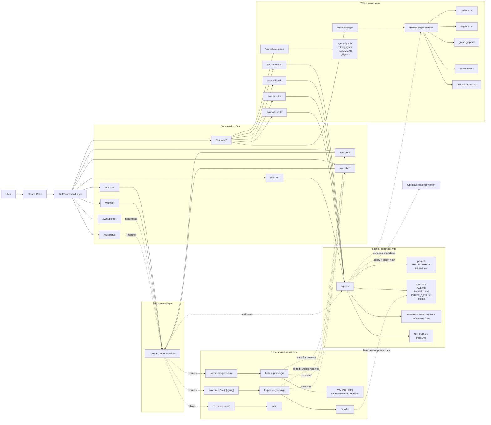

# Work Unit Roadmap — a Claude Code Plugin

Turn any coding agent into a disciplined senior engineer: atomic Work Units, isolated git branches, verified review checkpoints, and a recoverable project history.

```text
Small task, verify, commit. Repeat.
```

## What is this?

Most AI coding sessions produce a large changeset the human can't revert cleanly or understand incrementally. There's no accountability trail, no way to bisect a bug to a specific decision, and the project state is always one bad session away from chaos.

Work Unit Roadmap enforces a different pattern. Every change is scoped to one **Work Unit** — a small, bounded, verifiable goal. Each WU gets one git commit containing both the implementation and the roadmap update. Phases run on dedicated git branches via `git worktree`, merging into `main` only after human approval.

The `agents/` folder is the unified project wiki: roadmap, research, decisions, and docs in one place. Every page has YAML frontmatter (`type`, `status`, `tags`) and `[[wikilinks]]` that connect phases, fix rounds, decisions, and research. Open `agents/` in Obsidian for instant graph view — see what's done, what's active, what's blocked. Fix rounds live in their own files, separate from the phase file.

The result: a git history where every commit is cherry-pickable, every bug is bisectable, and any session can be recovered from first principles by reading `agents/roadmap/ALL.md` and `git log`.

## Scope boundary

Canonical scope contract lives in `skills/wur-guidelines/SKILL.md` (`## Scope Boundary`).
This README is package/user documentation; runtime agent behavior is defined by
the `skills/` and `commands/` files.

Short form:
- **Wiki = plan**
- **Outside wiki = execution + checks**
- No hosted CI/CD, deployment pipelines, cloud services, or project-specific runtime infrastructure inside WUR.

## Why use it

Without discipline, an AI agent will:

- Bundle unrelated changes into one commit
- Switch branches with `git checkout` instead of worktrees
- Update the roadmap in a separate commit after the fact
- Append fix WUs to the same file as planned WUs until the phase file has 50 rows
- Mark Work Units done without client review

WUR prevents all of this through three composable skills and thirteen command procedures. You decide *what* to build; WUR enforces *how* to track, isolate, and commit it.

## Control model

WUR has already solved the organization problem. The remaining problem is control.

- The right path should be the easiest path.
- The wrong path should be blocked — or at minimum leave a trace.
- Enforcement does not need to be smart. It needs to be hard to bypass.

### Non-bypass rules

1. **No workspace re-init by accident.** `/wur:init` must stop if `agents/` already exists, unless the user is intentionally resetting it.
2. **No phase execution before `/wur:init`.** If `agents/` does not exist, `/wur:start` must stop.
3. **No implementation outside a worktree.** Code/test/config changes must happen in `.worktrees/phase-{n}` or `.worktrees/fix-{n}-{slug}`.
4. **No phase close while fix rounds are active.** `/wur:done` must stop if any related fix round in `PHASE_{n}_FIX.md` remains `active`.
5. **No phase close without test status.** `/wur:done` requires `test_status = pass` or `test_status = waived` with a reason.
6. **No implementation commit without roadmap state.** Code and roadmap updates belong in the same WU commit.
7. **No self-close.** Agents must not run `/wur:done` unless the current client request explicitly invokes `/wur:done`.
8. **No self-accepted WUs.** Agents move WUs to `ready-for-review`; only the client can accept or close them as `done`.

### Allowed waives

Use waives sparingly. A waive is valid only when it leaves a trace.

1. **No test suite exists** — record `test_status: waived` and why.
2. **Tooling is flaky outside the WU scope** — record the external blocker.
3. **Exploratory / spike phase** — record that the phase is exploratory and why full verification is waived.
4. **Required device/manual environment is unavailable** — record what environment is missing.
5. **Graph layer not enabled** — graph-specific checks can be skipped until `/wur:wiki:upgrade` is run.

### Enforcement anchors — raw-git is closed

`/wur:init` **installs and verifies** project-root git hooks via `.githooks/`. The install is gating: if the smoke test fails, the workspace is not scaffolded. There is no opt-out.

- `commit-msg` — accepts only `WU-P{n}-(\d{3}[a-z]?|close|fix|abort): …`, `WU-TW-{k}: …`, or `Phase {n}: merge …`. Anything else is rejected at the git layer.
- `pre-commit` — blocks implementation commits on the default branch, requires `agents/roadmap/` updates in the same commit as code, and requires the current branch to match the active phase. Exempt for clean merge / cherry-pick / revert commits.
- `pre-push` — blocks pushing the default branch while a phase or active Work Unit is still recorded in `agents/roadmap/ALL.md`.

Together they close the only escape hatches that previously existed: `git commit -m "fix"`, `git checkout main && git commit ...`, and `git push origin main` while a phase is open. The hooks are tiny, dependency-free, and do not plan — they only allow / block / require trace.

To bypass, an operator must `--no-verify` (which is itself audit-visible in git's reflog) or move `.githooks/` aside (which the next `/wur:init` will detect). Both paths leave a trace. There is no silent wrong path left.

## Installation

### Claude Code — marketplace (recommended)

```text
/plugin marketplace add truong170201/work-unit-roadmap
/plugin install wur@work-unit-roadmap
/reload-plugins
```

> **Plugin not found?** Force refresh the cache, then retry:
>
> ```text
> /plugin marketplace update work-unit-roadmap
> /plugin install wur@work-unit-roadmap
> ```
>
> Still failing? Check what the marketplace actually sees:
>
> ```text
> /plugin list --available
> ```

### Claude Code — local clone

```bash
git clone https://github.com/truong170201/work-unit-roadmap.git
```

```text
/plugin install .
/reload-plugins
```

### Cross-platform guarantees

WUR is designed to behave the same way on **Windows, Linux, and macOS**:

- **Git hooks** — Git executes hooks through its own `sh` runtime (`sh.exe` on Git for Windows, system `sh` on Linux/macOS), so hooks fire correctly from **PowerShell, cmd, Git Bash, Terminal.app, or standard shells**.
- **`chmod +x`** — required on Linux/macOS to set the executable bit; a harmless no-op on Windows.
- **Path separators** — the Python graph scripts normalize all output paths to `/`, so JSONL, SQLite metadata, lint messages, and stats output are stable across platforms.
- **Graph scripts** — require Python 3.10+ and `PyYAML`; otherwise they use only the Python standard library.
- **Canonical markdown** — `agents/` pages remain the source of truth on every platform; derived graph artifacts can always be rebuilt.

## Quick start

### 1. Bootstrap the project wiki in `agents/`

```text
/wur:init "Build an internal inventory app for warehouse operators."
```

This creates the base `agents/` workspace:

- `agents/project/PHILOSOPHY.md` and `USAGE.md`
- `agents/roadmap/ALL.md` and `agents/roadmap/log.md`
- `agents/SCHEMA.md` and `agents/index.md`
- `agents/raw/`, `research/`, `docs/`, `reports/`, `references/`

The argument is optional project context. The agent should use it as a supplement, then derive the project objective from existing `agents/` files, obvious project files, or the current conversation. If none of those contain enough context, it must ask for a one-sentence project description before creating `agents/`; WUR should not bootstrap a placeholder-only project wiki.

At this point, `agents/` already exists as the project's wiki. It is the single source of truth for roadmap, research, decisions, and reports.

### 2. Optional: upgrade `agents/` with the graph layer

```text
/wur:wiki:upgrade
```

This does **not** create a second wiki. It upgrades the existing `agents/` wiki with graph-aware files and conventions:

- `agents/graph/ontology.yaml` — typed node + predicate contract with `maps_from` and `subject/object_types`
- `agents/graph/README.md` and `agents/graph/.gitignore`
- graph conventions for `type`, `status`, `tags`, `parent`, `depends_on`, `verifies`, `informs`
- canonical path-style wikilink rules such as `[[roadmap/PHASE_1]]`

Then run `/wur:wiki:graph extract` to compile the derived graph artifacts:

| Artifact | Tracked? | Purpose |
|---|---|---|
| `nodes.jsonl` / `edges.jsonl` | ✅ yes | Graph diffs in PRs; agent queries without re-extract |
| `graph.sqlite` | ❌ gitignored | Relational DB for fast typed-edge queries |
| `graph.graphml` | ❌ gitignored | Gephi / yEd visualisation |

If you care about visual project state — what is open, closed, blocked, what depends on what — run `/wur:wiki:upgrade` early, then `/wur:wiki:graph extract` when you want derived artifacts.

### 3. Start execution for a phase

```text
/wur:start 1
```

This is the moment execution leaves the main repo and enters a worktree:

- creates `.worktrees/phase-1`
- creates branch `feature/phase-1`
- runs baseline setup/tests in that worktree
- scaffolds `agents/roadmap/PHASE_1.md`
- updates `agents/roadmap/ALL.md`
- appends `phase-open` to `agents/roadmap/log.md`
- updates `agents/index.md`
- commits the setup as a Tiny WU on the feature branch

### 4. Work loop — one Work Unit at a time

Inside `.worktrees/phase-1` only:

1. Implement one WU
2. Run verification (`npx tsc`, `pytest`, etc.)
3. Update the relevant roadmap files
4. Commit code + roadmap together in one commit

Example commit:

```text
git commit -m "WU-P01-003: add login validation"
```

Roadmap update and implementation are one commit — never two.

### 5. If testing finds bugs, open a fix round

```text
/wur:test fail: short-circuit on empty input
```

This creates a dedicated fix branch and worktree:

- `.worktrees/fix-1-empty-input`
- branch `fix/phase-1-empty-input`
- `agents/roadmap/PHASE_1_FIX.md`
- a Fix Rounds row in `PHASE_1.md`
- a fix entry in `agents/index.md`
- `fix-open` in `agents/roadmap/log.md`
- a Tiny WU commit for the fix-round setup

Fix WUs live in the phase fix ledger — one `PHASE_{n}_FIX.md` file per phase, not one markdown file per bug batch.

### 6. Close the phase

```text
/wur:test pass
/wur:done
```

`/wur:done` is the phase close transaction. It:

- runs only when the current client request explicitly invokes `/wur:done`
- verifies fix rounds are closed
- merges `feature/phase-1` into `main` with `git merge --no-ff`
- updates phase frontmatter (`status: done`, `closed: {today}`)
- updates `agents/index.md`
- appends `phase-close` to `agents/roadmap/log.md`
- commits the closeout metadata
- removes worktrees and deletes local phase/fix branches

## Commands

### Command reference

| Command | Run from | When to use | What it changes | Commit / log behavior |
|---|---|---|---|---|
| `/wur:init` | main repo | Once per project | Creates `agents/` base wiki (schema `1`): project docs, roadmap, log, schema, index, raw/research/docs/reports/references, plus `.githooks/` enforcement hooks installed and smoke-tested | Refuses if `agents/` already exists; creates initial bootstrap commit; appends `workspace-init` to `agents/roadmap/log.md` |
| `/wur:upgrade` | main repo | After pulling a newer WUR plugin version, or once on a legacy `agents/` | 1) Detects `schema_version`; backfills to `1` if missing. 2) Creates a git backup tag. 3) Creates missing folders/files with canonical templates. 4) Migrates existing files to schema compliance: adds missing SCHEMA.md sections, adds frontmatter (`type`, `status`, `tags`) to graph pages, patches ALL.md missing sections, updates index.md coverage. 5) Verifies all wikilinks, frontmatter, and index coverage. 6) Commits one Tiny WU and deletes backup tag if verification passes; preserves backup tag if verification fails. | Treats current state as raw input; refuses if workspace declares a newer schema than the plugin knows; one Tiny WU commit; appends `schema-upgrade` to log |
| `/wur:wiki:upgrade` | main repo | After `/wur:init`, when you want graph/wiki features | Adds graph-layer files and conventions: `agents/graph/ontology.yaml`, `README.md`, `.gitignore`, link/edge rules | No worktree; no execution branch; wiki-only upgrade; does not bump `schema_version` |
| `/wur:start {n}` | main repo → then `.worktrees/phase-{n}` | Start execution for phase `n` | Creates `feature/phase-{n}` and `.worktrees/phase-{n}`, scaffolds `PHASE_{n}.md`, updates `ALL.md`, `index.md`, and `log.md` | Blocks if another phase is already active; commits phase setup as a Tiny WU; appends `phase-open` |
| `/wur:test fail: ...` | phase worktree → fix worktree | Open or append a fix round after tests fail | Creates `fix/phase-{n}-{slug}`, `.worktrees/fix-{n}-{slug}`, and the consolidated `PHASE_{n}_FIX.md` ledger; updates phase Fix Rounds, `ALL.md`, `index.md`, `test_status`, and `log.md` | Requires an active phase; commits fix-round setup as a Tiny WU; appends `fix-open`; fix WUs stop at `ready-for-review` |
| `/wur:test pass` | phase worktree or main repo after test run | Record that tests passed and phase is ready for client closeout | Updates phase `test_status: pass` and clears waive reason | Requires an active phase; no merge; asks the client to send `/wur:done` |
| `/wur:test waive: <reason>` | phase worktree or main repo | Record that closeout readiness is waived without a clean pass | Updates phase `test_status: waived` and stores the waive reason | Requires an active phase; no merge; asks the client to send `/wur:done` and leaves an explicit trace |
| `/wur:done` | main repo + phase worktree as needed | Close a verified phase after explicit client command | Merges phase branch into default branch, updates phase status/frontmatter, updates `ALL.md`, `index.md`, and `log.md`, removes worktrees | Blocks if the current request did not invoke `/wur:done`; blocks if an active WU remains; requires `test_status = pass` or `waived`; creates phase-close commit and appends `phase-close` |
| `/wur:abort {n}` | main repo + phase worktree | Abandon a phase started by mistake | Force-removes phase + fix worktrees, deletes feature/fix branches without merging, marks phase `aborted` in roadmap, records reason in `log.md` | Refuses if `feature/phase-{n}` has commits not in `$base` unless explicitly confirmed; never reaches the default branch |
| `/wur:status` | anywhere | Get the current execution snapshot | Reads current branch/worktree state, `ALL.md`, phase test state, fix rounds, blockers, and recent `log.md` | Read-only; acts as the read model of enforcement state |
| `/wur:wiki:add {src}` | main repo | Ingest external knowledge into the project wiki | Stores source in `agents/raw/`, writes research into `agents/research/`, updates linked docs/pages, updates `agents/index.md`, appends to roadmap log | No worktree; wiki-only mutation; suggests `/wur:wiki:graph extract` if graph artifacts are now stale |
| `/wur:wiki:ask {q}` | main repo | Query the `agents/` wiki | Reads `agents/SCHEMA.md`, `agents/index.md`, follows `[[wikilinks]]`, and can use graph artifacts for relational navigation when present | Read-only unless you explicitly ask to file synthesis back |
| `/wur:wiki:lint` | main repo | Audit the wiki for structural/semantic issues | Checks `agents/` for broken links, missing frontmatter on graph pages, stale active pages, and graph consistency when the graph layer exists | Proposed edits only; appends `wiki-lint` to `agents/roadmap/log.md` |
| `/wur:wiki:stats` | main repo | Get a dashboard for the wiki and graph layer | Counts phases, fix rounds, research/docs/reports, status distribution, orphan pages, and graph freshness | Read-only |
| `/wur:wiki:graph {action}` | main repo | Extract, lint, or query the derived graph | Builds `nodes.jsonl`, `edges.jsonl`, `graph.sqlite` (gitignored), `graph.graphml` (gitignored) from canonical `agents/` pages; checks graph validity against ontology including tag format rules; or answers typed relationship queries | Derived-graph operations; canonical citations always come from `agents/` pages |

### Operational split

- **Execution commands**: `/wur:*`
- **Wiki commands**: `/wur:wiki:*`
- **Execution uses worktrees**: yes
- **Wiki uses worktrees**: no
- **Execution writes commits/branches**: yes
- **Wiki enriches `agents/` knowledge state**: yes
- **Graph artifacts are derived**: yes — markdown under `agents/` remains canonical

## Architecture



This is the core model:

- `agents/` is the canonical wiki and source of truth
- `/wur:*` handles execution and always uses worktrees
- `/wur:wiki:*` handles knowledge and graph operations without worktrees
- `agents/graph/` is derived from canonical markdown and can be rebuilt at any time
- the enforcement layer sits between commands and execution: it blocks invalid paths, requires the right preconditions, and records waives
- the enforcement layer is **read-only** with respect to `agents/`: it validates against the wiki but never writes to it. Only commands and Work Units mutate the wiki
- `/wur:init` is state setup — it bootstraps `agents/` and refuses to overwrite an existing workspace, but is not gated by the enforcement layer the way execution commands are
- `/wur:status` is the read model of enforcement state, not just a git snapshot
- merge is gated through an explicit client `/wur:done`; branches do not flow to `main` directly
- fix rounds feed back into phase state and must be resolved before closeout
- `/wur:abort` is the only legitimate exit path that does *not* merge; it has three modes (`hard` / `soft` / `waived`) so an operator can stop without lying to the roadmap

## How it works

```text
/wur:init
  └─ creates agents/ as the base project wiki
  └─ resolves optional user context plus existing project context
  └─ writes PHILOSOPHY.md, USAGE.md, ALL.md, log.md, SCHEMA.md, index.md

/wur:wiki:upgrade
  └─ upgrades agents/ with graph-layer files and conventions
  └─ creates agents/graph/ontology.yaml, README.md, .gitignore
  └─ keeps agents/ as the single wiki root

/wur:start {n}
  └─ git worktree add .worktrees/phase-{n} -b feature/phase-{n} main
  └─ execution now happens only inside that worktree
  └─ scaffolds PHASE_{n}.md with frontmatter + wikilinks
  └─ updates ALL.md, index.md, log.md
  └─ commits setup as WU-TW-{k}

Work loop inside .worktrees/phase-{n}:
  implement one WU
    → verify
    → update roadmap/wiki state
    → commit once as WU-P{n}-{unit}

bugs found → /wur:test fail
  └─ git worktree add .worktrees/fix-{n}-{slug} -b fix/phase-{n}-{slug}
  └─ creates or appends PHASE_{n}_FIX.md with frontmatter + parent wikilink
  └─ updates phase Fix Rounds, index.md, log.md
  └─ commits setup, then fix WUs to ready-for-review; client decides closeout

/wur:wiki:add
  └─ adds research knowledge to agents/
  └─ updates research/docs/index/log without touching worktrees
  └─ suggests /wur:wiki:graph extract when derived graph artifacts become stale

/wur:wiki:graph extract
  └─ derives nodes.jsonl, edges.jsonl (tracked) from canonical agents/ pages
  └─ derives graph.sqlite (gitignored) for fast typed-edge queries
  └─ appends wiki-graph-extract to roadmap log

/wur:done
  └─ git merge --no-ff feature/phase-{n}   ← all WU commits preserved
  └─ updates phase/frontmatter/index/log on main
  └─ removes worktrees and local branches
```

**Git log guarantee:** every implementation WU commit lands on `feature/phase-{n}` or `fix/phase-{n}-{slug}`. After `--no-ff` merge, each WU remains individually cherry-pickable, revertable, and bisectable. The main repo never becomes the execution branch.

## Repository structure

```text
work-unit-roadmap/
  README.md
  CLAUDE.md / AGENTS.md          # Bootstrap (invoke using-wur first)
  .gitignore                     # Ignores /raw, /experiments, .worktrees/
  .claude-plugin/
    plugin.json                  # Claude Code plugin manifest
    marketplace.json             # Claude Code marketplace metadata
  skills/                        # Claude Code skills; other platforms can copy manually
    using-wur/SKILL.md           # Bootstrap skill — invoke first
    wur-guidelines/SKILL.md      # Core workflow
    wur-guidelines/references/
      git-hooks.md               # Minimal git hook templates for enforcement anchors
    wur-guidelines/scripts/
      wur_graph_extract.py       # Real graph extractor (JSONL / SQLite / GraphML)
      wur_graph_lint.py          # Deterministic wiki + graph validator
      wur_graph_query.py         # Query graph.sqlite (or JSONL fallback)
      wur_wiki_stats.py          # Deterministic wiki/graph dashboard
      wur_meta_consistency.py    # Local consistency checker for spec/doc/script drift
    using-git-worktrees/SKILL.md # Worktree isolation + git log guarantee
  commands/                      # Phase lifecycle + workspace command procedures
    init.md   upgrade.md   start.md   done.md   abort.md   test.md   status.md
    wiki/                        # Wiki command procedures
      upgrade.md   add.md   ask.md   lint.md   stats.md   graph.md
  tests/
    fixtures/agents_clean/       # Clean WUR workspace used by script tests
    test_wur_graph_scripts.py    # End-to-end extractor/lint/query/stats tests
    test_wur_meta_consistency.py # Consistency checker tests
```

## 9+/10 readiness checklist

Use this as the practical definition of a production-ready WUR wiki layer for a dev project:

- [ ] `/wur:init` hook smoke test passes
- [ ] `agents/SCHEMA.md` contains `type`, `status`, `tags`, tag conventions, and status `aborted`
- [ ] `/wur:upgrade` has been run on any legacy workspace and logs `schema-upgrade`
- [ ] `/wur:wiki:upgrade` has been run when graph features are needed
- [ ] `python skills/wur-guidelines/scripts/wur_graph_lint.py agents/` returns **0 errors**
- [ ] `python skills/wur-guidelines/scripts/wur_graph_extract.py agents/` produces fresh `nodes.jsonl`, `edges.jsonl`, and `graph.sqlite`
- [ ] `python skills/wur-guidelines/scripts/wur_wiki_stats.py agents/` shows no broken links and no missing frontmatter
- [ ] `python skills/wur-guidelines/scripts/wur_meta_consistency.py .` returns **0 issues**
- [ ] `python -m unittest discover -s tests -v` passes locally
- [ ] `agents/index.md` covers every graph page (`## Roadmap`, `## Research`, `## Docs`, `## Reports`)
- [ ] `agents/roadmap/ALL.md` Commit Index is archived once it exceeds 30 rows
- [ ] `agents/roadmap/log.md` remains append-only and merge conflicts preserve entries from both sides

If all eleven are true, WUR is operating in the deterministic, low-drift mode needed for long-running software projects.

## Other platforms

Claude Code is the only bundled first-class plugin target in this repo. Other platforms are not bundled as first-class plugin targets: there is no Codex manifest, no Cursor package, and no Windsurf package.

The skills use the standard [agentskills.io](https://agentskills.io) format. For another agent client, copy `skills/` and `commands/` into that client's supported configuration shape, then create a bootstrap file that invokes `using-wur` first.

**Cursor** — `.cursor/rules/work-unit-roadmap.mdc`:

```markdown
---
description: Work Unit Roadmap — invoke using-wur before any work
globs: "**/*"
alwaysApply: true
---
MANDATORY FIRST STEP: Invoke `using-wur` first, then `wur-guidelines`. Skills live under `skills/`.
```

**Windsurf** — `.windsurf/rules/work-unit-roadmap.md`:

```markdown
MANDATORY FIRST STEP: Invoke `using-wur` first, then `wur-guidelines`. Skills live under `skills/`.
```

**Gemini CLI / others** — copy `skills/` and `commands/`, then reference `skills/using-wur/SKILL.md` in your platform's bootstrap.

Claude Code exposes the commands as `/wur:*` and `/wur:wiki:*`. Other clients may reuse the same `commands/` files only if they have their own command mechanism; otherwise invoke the same intent in natural language, such as "start phase 2", "open a fix round", or "lint the wiki".

## License

MIT
